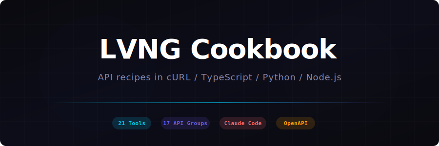

<div align="center">

<picture>
  <source media="(prefers-color-scheme: dark)" srcset=".github/banner.svg">
  <source media="(prefers-color-scheme: light)" srcset=".github/banner.svg">
  
</picture>

<br /><br />

[](https://lvng.ai/docs/api)
[](https://lvng.ai/docs/cookbook)
[](https://lvng.ai/docs/openapi.json)
[](LICENSE)

</div>

<br />

## Quick Start

```bash
# 1. Get an API key → https://app.lvng.ai/settings/developer
# 2. Export it
export LVNG_API_KEY="lvng_sk_live_..."

# 3. Try it
curl https://api.lvng.ai/api/v2/workflows \
  -H "x-api-key: $LVNG_API_KEY" | jq '.data[].name'
```

<br />

## Install

```bash
# MCP Server — connects Claude Code to your LVNG workspace (21 tools)
npm install -g https://api.lvng.ai/packages/lvng-mcp-server-1.0.0.tgz

# TypeScript SDK — programmatic access with full types
npm install https://api.lvng.ai/packages/lvng-sdk-1.0.0.tgz
```

<br />

## Recipes

> Every recipe has **cURL**, **TypeScript**, **Python**, and **Node.js** variants. Click any link to view the source.

<table>
<tr>
<td width="200"><strong>Recipe</strong></td>
<td width="140" align="center"><strong>cURL</strong></td>
<td width="140" align="center"><strong>TypeScript</strong></td>
<td width="140" align="center"><strong>Python</strong></td>
<td width="140" align="center"><strong>Node.js</strong></td>
</tr>

<tr>
<td>List workflows</td>
<td align="center"><a href="curl/list-workflows.sh"><code>.sh</code></a></td>
<td align="center"><a href="typescript/list-workflows.ts"><code>.ts</code></a></td>
<td align="center"><a href="python/list_workflows.py"><code>.py</code></a></td>
<td align="center"><a href="nodejs/list-workflows.js"><code>.js</code></a></td>
</tr>

<tr>
<td>Execute workflow</td>
<td align="center"><a href="curl/execute-workflow.sh"><code>.sh</code></a></td>
<td align="center"><a href="typescript/execute-workflow.ts"><code>.ts</code></a></td>
<td align="center"><a href="python/execute_workflow.py"><code>.py</code></a></td>
<td align="center"><a href="nodejs/execute-workflow.js"><code>.js</code></a></td>
</tr>

<tr>
<td>Create agent</td>
<td align="center"><a href="curl/create-agent.sh"><code>.sh</code></a></td>
<td align="center"><a href="typescript/create-agent.ts"><code>.ts</code></a></td>
<td align="center"><a href="python/create_agent.py"><code>.py</code></a></td>
<td align="center">—</td>
</tr>

<tr>
<td>Message agent</td>
<td align="center"><a href="curl/message-agent.sh"><code>.sh</code></a></td>
<td align="center"><a href="typescript/message-agent.ts"><code>.ts</code></a></td>
<td align="center"><a href="python/message_agent.py"><code>.py</code></a></td>
<td align="center">—</td>
</tr>

<tr>
<td>Search knowledge</td>
<td align="center"><a href="curl/search-knowledge.sh"><code>.sh</code></a></td>
<td align="center"><a href="typescript/search-knowledge.ts"><code>.ts</code></a></td>
<td align="center"><a href="python/search_knowledge.py"><code>.py</code></a></td>
<td align="center">—</td>
</tr>

<tr>
<td>Stream chat (SSE)</td>
<td align="center"><a href="curl/stream-chat.sh"><code>.sh</code></a></td>
<td align="center"><a href="typescript/stream-chat.ts"><code>.ts</code></a></td>
<td align="center"><a href="python/stream_chat.py"><code>.py</code></a></td>
<td align="center">—</td>
</tr>

<tr>
<td>Manage API keys</td>
<td align="center"><a href="curl/api-keys.sh"><code>.sh</code></a></td>
<td align="center">—</td>
<td align="center"><a href="python/api_keys.py"><code>.py</code></a></td>
<td align="center">—</td>
</tr>

</table>

<br />

## Claude Code

Connect Claude Code to your workspace with 21 MCP tools — workflows, agents, and knowledge all from your terminal.

```json
{
  "mcpServers": {
    "lvng": {
      "command": "lvng-mcp-server",
      "env": {
        "LVNG_API_KEY": "lvng_sk_live_..."
      }
    }
  }
}
```

Then just ask Claude:

```
> list my workflows
> create an agent called "Data Analyst" with web search tools
> search knowledge for "Q4 revenue"
> execute workflow wf_123 with topic "market research"
```

<details>
<summary><strong>All 21 MCP Tools</strong></summary>
<br />

| Category | Count | Tools |
|----------|-------|-------|
| **Workflows** | 9 | `list` `get` `create` `update` `delete` `execute` `get_run` `list_runs` `parse` |
| **Agents** | 8 | `list` `get` `create` `update` `delete` `message` `start` `stop` |
| **Knowledge** | 4 | `search` `ingest` `list_entities` `get_stats` |

</details>

<br />

## API Key Format

```
lvng_sk_live_7e8949d627f560d298f310ceeadb492c
│       │    │
│       │    └── 32 random hex characters
│       └── Environment (live / test)
└── Prefix (identifies as LVNG per-user key)
```

- Keys are **SHA-256 hashed** at rest — never stored in plaintext
- Raw key shown **once** at creation — store it securely
- Max **10 active keys** per user
- Scopes: `read` · `write` · `execute` · `admin` · `knowledge:read` · `knowledge:write`

<br />

## Links

| Resource | URL |
|----------|-----|
| API Reference | [lvng.ai/docs/api](https://lvng.ai/docs/api) |
| Cookbook (web) | [lvng.ai/docs/cookbook](https://lvng.ai/docs/cookbook) |
| SDKs & Claude Code | [lvng.ai/docs/sdks](https://lvng.ai/docs/sdks) |
| API Keys | [lvng.ai/docs/api/api-keys](https://lvng.ai/docs/api/api-keys) |
| OpenAPI Spec | [lvng.ai/docs/openapi.json](https://lvng.ai/docs/openapi.json) |
| Developer Settings | [app.lvng.ai/settings/developer](https://app.lvng.ai/settings/developer) |

<br />

<div align="center">

Made by [LVNG](https://lvng.ai) · MIT License

</div>
